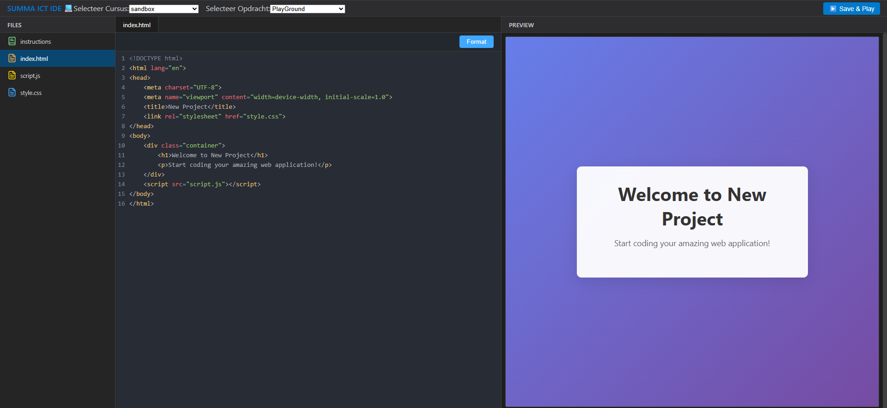

SUMMA ICT — Lightweight Web IDE

A compact, browser-based learning IDE built with Vue 3 and Vite. Designed for classroom exercises and small web projects where students can edit HTML/CSS/JS and see an immediate preview.



Table of contents
- Summary
- Quick start
- Features
- File / component map
- How it works (brief)
- Scripts
- Usage tips
- Limitations & next steps

## Summary
Minimal, self-contained web IDE for teaching HTML/CSS/JS.
Projects are stored as JSON under `public/projects/json` and exposed via `public/projects/manifest.json`.
Editor: CodeMirror 6; Formatter: Prettier; Preview: sandboxed iframe.

## Quick start (Windows PowerShell)
Open a PowerShell terminal in the project root and run:

```powershell
# Install dependencies (one-time)
npm install

# Start the development frontend (Vite)
npm run dev

# Start the small admin backend (serves /admin and provides simple APIs)
# In a separate terminal window run:
npm run start-admin

# The default ports used by this project:
# - Frontend (Vite dev server): http://localhost:5173/
# - Backend admin server:    http://localhost:5174/ (admin UI served under /admin)

# Example: open the frontend in your browser and the admin dashboard
# Frontend: http://localhost:5173/
# Admin dashboard: http://localhost:5174/admin/dashboard.html
```

Notes:
- If PowerShell blocks npm.ps1 execution, run `npm.cmd install` (or use a normal Command Prompt) or update the execution policy.
- You can run the backend and frontend in separate terminals so they stay active.

## Features (at a glance)
- Project browser (by folder/course)
- File explorer with active-file highlighting
- Code editor with syntax highlighting, line numbers and keyboard bindings
- Context-aware autocompletion for HTML/CSS/JS
- One-click formatting (Prettier)
- Live preview in a sandboxed iframe (inlines CSS/JS)
- Saves edited content to localStorage via "Save & Play"

## File / component map
- `src/App.vue` — app shell, manifest loading, project selection, orchestration
- `src/main.js` — bootstrap
- `src/components/FileExplorer.vue` — file list UI
- `src/components/CodeEditor.vue` — CodeMirror integration and editor UI
- `src/components/PreviewPanel.vue` — assembles HTML/CSS/JS and renders iframe
- `src/components/CodeSuggestions.vue` — provides completion generators for CodeMirror
- `src/components/Format.vue` — Prettier wrapper for formatting

## How it works (brief)
On project select: the app fetches a JSON file from `public/projects/json/<file>.json` which contains a files map and optional instructions.
Files are loaded into an in-memory files object. The editor edits that object; the preview panel combines files into a single HTML string and sets it as the iframe `srcdoc`.
The "Save & Play" button writes editable files to `localStorage` and triggers a preview refresh.

## Scripts (from package.json)
- `npm run dev` — start Vite dev server (frontend)
- `npm run build` — build production bundle (vite)
- `npm run preview` — preview a production build
- `npm run watch:vue-pages` — helper Node script (if present)
- `npm run build:projects` — helper Node script (if present)
- `npm run start-admin` — start the small admin Express server (serves `public/admin` and provides simple project APIs)

## Usage tips
- If a project JSON contains an `instructions` field, it will appear as a virtual file named `instructions` and is opened first.
- Use the Format button in the editor header to apply Prettier formatting for the current file.
- The preview iframe is sandboxed (`allow-scripts allow-modals allow-forms`) so scripts run in the preview but cannot access the parent page.

## Limitations & next steps
- This is a lightweight educational IDE — it is intentionally minimal and not hardened for untrusted code execution in production.
- Consider adding authentication for the admin endpoints and sanitizing project imports for public deployments.

---

If you'd like, I can also add a small section with example PowerShell commands to run both servers in parallel (using Start-Process) and a helper npm script to start both with cross-env tooling.

